# BIB 2: Organismic Artificial Intelligence in Silicon

[](https://www.python.org/)
[](https://numpy.org/)
[]()
[]()
[](LICENSE)
[]()
[](ORGANISMIC_AI_PAPER.md)

> **"What if artificial intelligence wasn't an offline statistical calculator predicting words in a cloud data center, but a living, continuous-time organism surviving on a CPU?"**

**BIB 2 (Biologically Inspired Brain 2)** is developed by **[UnikAI Lab](https://www.unikai.in)** as the pioneering implementation of **Organismic Artificial Intelligence (OAI)**. It is a complete 1:1 macro-anatomical and functional computational replica of the **Human Nervous System** (Central, Peripheral, Autonomic, and Enteric systems) that runs deterministically at over **540 Hz** on standard CPU hardware with **zero GPU dependencies** and **zero backpropagation**.

📄 **Read the Full Scientific Research Paper**: [**Organismic Artificial Intelligence: Continuous Biological Computation, Homeostatic Drive, and Real-Time Plasticity in Silicon**](ORGANISMIC_AI_PAPER.md)

---

<div align="center">
  <h3>🎬 Watch the Official BIB 2 Launch Film</h3>
  <video src="https://github.com/tgakathunderr/BIB-2/raw/master/assets/bib2_launch.mp4" controls="controls" width="100%" style="max-width: 100%; border-radius: 8px;">
    <source src="assets/bib2_launch.mp4" type="video/mp4">
  </video>
</div>

---

## The Paradigm Shift: Organismic AI vs. Transformers

Today's AI industry is built around a single paradigm: static neural networks trained on massive offline text datasets. While Transformers have mastered language fluency, they do not possess agency, cannot learn in continuous real-time, and suffer from catastrophic forgetting. 

**BIB 2 introduces a fundamentally different computational frontier:**

| Dimension | Disembodied AI (Transformers / LLMs) | Deep RL (PPO / DQN) | Organismic AI (BIB 2) |
|---|---|---|---|
| **Core Objective** | Statistical next-token prediction | Game score maximization | **Allostatic survival (Homeostasis)** |
| **Compute Hardware** | Massive Cloud GPU Clusters (350W+) | Cloud / GPU Simulators | **Standard CPU / Edge Silicon (<5W)** |
| **Time Formulation** | Discrete sequence tokens | Discrete episode steps | **Continuous differential time ($\Delta t$)** |
| **Learning Mode** | Offline batch gradient descent | Offline multi-million frame rollouts | **100% Real-time, continuous online plasticity** |
| **Plasticity Rule** | Global backpropagation (SGD) | Bellman optimality / Policy gradients | **3-Factor Hebbian (Pre $\times$ Post $\times$ Dopamine RPE)** |
| **Memory Lifespan** | Frozen weights / Catastrophic loss | Severe catastrophic forgetting | **Slow-Wave Sleep (SWR Replay + Tononi SHY)** |
| **Reflex Latency** | 100 – 500 ms (Too slow for twitch control) | 10 – 50 ms | **< 1.9 ms (>540 Hz sustained throughput)** |
| **Intrinsic Motivation**| None (Passive prompt-response) | Static external reward function | **Brainstem vegetative loop & neurochemical drives** |

---

## Featured Benchmark: 100% Biological Pong

To empirically demonstrate continuous online learning without backpropagation, BIB 2 includes an interactive arcade embodiment: **Squash Pong** ([`examples/pong_bib2.py`](examples/pong_bib2.py)).

```
================================================================================
  BIB 2: 100% RAW BIOLOGICAL BRAIN PONG EXPERIMENT
  Perceptions, actions, and plasticity driven 100% by BIB 2 Nervous System.
  Zero external trajectory raycasts. Pure neurobiology.
================================================================================
```

### What Makes This Experiment Revolutionary?
1. **Zero Backpropagation**: There is no PyTorch graph, no loss tensor, and no gradient descent.
2. **Zero Geometric Heuristics**: The agent does not calculate ball trajectory vectors, bounce intersections, or physics raycasts.
3. **Pure Biological Perception**:
   - **Optic Nerve (`CN_II`, 64-dim)**: 32 vertical retinotopic receptive fields for ball elevation, 4 velocity channels, and 16 spatial difference fields.
   - **Spinal Dermatome (`C5`, 16-dim)**: Muscle spindle proprioception tracking paddle kinematics.
4. **Three-Factor Corticostriatal Plasticity**:
   - Intercepting the ball triggers a massive Dopamine burst ($\text{RPE} = +3.0$) and enteric satiety reward.
   - Missing the ball triggers an autonomic sympathetic surge ($\text{RPE} = -2.0$) and Lateral Habenula anti-reward suppression.
   - In-flight tracking generates continuous visual pursuit error feedback.
5. **Slow-Wave Sleep (SWS) Consolidation**: Every round, the agent triggers a sleep cycle: Hippocampal Sharp-Wave Ripples (SWRs) replay motor trajectories while Tononi SHY downscales weights by 5% to prevent cortical saturation and catastrophic forgetting.
6. **Cybernetic Telemetry HUD**: Features a real-time cardiac ECG oscilloscope, live neurotransmitter gauges (Dopamine, Serotonin, Norepinephrine, Cortisol), Basal Ganglia $D_1/D_2$ gating states, and Brodmann neocortical heatmaps.

### Reproducible Empirical Benchmark Results

```
+---------------------------------------------------------------------------------------------------------+
|                    EMPIRICAL MULTI-SEED CURRICULUM BENCHMARK (5,000 STEPS / SEED)                       |
+------------+------------------------------------+------------------------------------+------------------+
| Seed       | Random Control (Hits / Misses / %) | BIB 2 Agent (Hits / Misses / %)    | Final Curriculum |
+------------+------------------------------------+------------------------------------+------------------+
| Seed 1     | 14 Hits /  9 Misses ( 60.9%)       | 20 Hits /  0 Misses (100.0%)       | Toddler (250px)  |
| Seed 2     | 11 Hits /  7 Misses ( 61.1%)       | 10 Hits /  1 Misses ( 90.9%)       | Toddler (250px)  |
| Seed 42    |  6 Hits /  0 Misses (100.0%)       | 18 Hits /  1 Misses ( 94.7%)       | Toddler (250px)  |
| Seed 100   | 10 Hits /  1 Misses ( 90.9%)       | 18 Hits /  1 Misses ( 94.7%)       | Toddler (250px)  |
| Seed 999   |  4 Hits /  1 Misses ( 80.0%)       | 10 Hits /  0 Misses (100.0%)       | Toddler (250px)  |
+------------+------------------------------------+------------------------------------+------------------+
| OVERALL    | 45 Hits / 18 Misses ( 71.4%)       | 76 Hits /  3 Misses ( 96.2%)       | -83.3% Errors    |
+------------+------------------------------------+------------------------------------+------------------+
```

### Run the Experiment
```bash
# Multi-Seed Empirical Benchmark (Validates 5 independent random seeds)
python examples/pong_bib2.py --benchmark

# Headless Benchmark (Runs 5,000 steps deterministically with seed=42)
python -c "from examples.pong_bib2 import run_headless; run_headless(5000)"

# Interactive Visual UI (Requires pygame)
python examples/pong_bib2.py
```

**Controls in Interactive Mode**:
- `[SPACE]`: Toggle Fast-Train Mode ($100\times$ speed vs $60\text{ FPS}$ real-time)
- `[S]`: Trigger manual Slow-Wave Sleep (SWS) memory consolidation & Tononi SHY downscaling
- `[ESC]` or `[Q]`: Exit

---

## Table of Contents

- [The Paradigm Shift: Organismic AI vs. Transformers](#the-paradigm-shift-organismic-ai-vs-transformers)
- [Featured Benchmark: 100% Biological Pong](#featured-benchmark-100-biological-pong)
- [System Architecture](#system-architecture)
- [The 14 Macro-Subsystems](#the-14-macro-subsystems)
- [Pluggable Domain Adapters](#pluggable-domain-adapters)
  - [Robotics Adapter](#robotics-adapter)
  - [Language Adapter](#language-adapter)
  - [Autonomous Agent RL Adapter](#autonomous-agent-rl-adapter)
- [Performance & Benchmarks](#performance--benchmarks)
- [Quickstart & Installation](#quickstart--installation)
- [Verification & Running Tests](#verification--running-tests)
- [Directory Structure](#directory-structure)
- [Primary Scientific Literature](#primary-scientific-literature)
- [License](#license)

---

## System Architecture

```mermaid
graph TD
    subgraph PNS ["Peripheral Nervous System (PNS)"]
        CN["Cranial Nerves (CN I–XII)"]
        SN["31 Bilateral Spinal Pairs (C1–Co1)"]
        ANS["Autonomic System (Sympathetic & Parasympathetic Vagus)"]
        ENS["Enteric Nervous System (500M Neurons Gut-Brain Axis)"]
    end

    subgraph Spinal ["Spinal Cord Engine"]
        RL["Rexed Laminae I–X"]
        SR["Monosynaptic Stretch & Crossed-Extensor Reflexes"]
        DCML["Ascending DCML (Touch) & Spinothalamic (Pain/Temp) Tracts"]
        CST["Descending Corticospinal Motor Tracts (85% Decussation)"]
    end

    subgraph Brainstem ["Brainstem Complex"]
        PB["Pre-Bötzinger Pacemaker (Autonomous Respiration)"]
        NTS["Medullary Baroreflex (NTS -> CVLM -| RVLM)"]
        IO["Inferior Olive (Climbing Fiber Oscillations)"]
        LC["Pons Locus Coeruleus (NE) & REM Muscle Atonia"]
        SC["Midbrain Colliculi (Saccades) & PAG (Threat Reaction)"]
    end

    subgraph Diencephalon ["Diencephalon"]
        TH["Thalamic Relay Nuclei (LGN, MGN, VPL, VPM, VA/VL, Pulvinar)"]
        TRN["Thalamic Reticular Nucleus (Attentional Gating & Spindles)"]
        HYP["Hypothalamus (SCN Circadian Clock & Arcuate Hunger/Satiety)"]
        LH["Lateral Habenula (Anti-Reward / Disappointment Signaling)"]
    end

    subgraph Cerebellum ["Cerebellar Forward Model"]
        GC["Granule Cells (4x Expansion) & Parallel Fibers (10–50 Hz)"]
        PC["Purkinje Cells & Climbing Fiber LTD (AMPA Internalization)"]
        DCN["Deep Cerebellar Nuclei (Dentate, Interposed, Fastigial)"]
    end

    subgraph Telencephalon ["Telencephalon & Neocortex"]
        BG["Basal Ganglia (D1 Go, D2 NoGo, STN Hyperdirect Stop)"]
        HIP["Hippocampus (DG KWTA Separation, CA3 Auto-Association, CA1)"]
        AMY["Amygdala (BLA Threat Appraisal & CeA Autonomic Drive)"]
        NC["6-Layer Neocortex (14 Specialized Brodmann Areas)"]
        CLA["Claustrum Multi-Modal Binding Hub"]
        TN["Tri-Network Switch (DMN / CEN / Salience Network)"]
    end

    subgraph Chemistry ["Chemical Matrix & Homeostasis"]
        NM["Neuromodulators (DA, 5-HT, NE, ACh, Histamine)"]
        HPA["HPA Stress Axis (CRH -> ACTH -> Cortisol Negative Feedback)"]
        SL["3-Stage Sleep Engine (NREM -> SWS SWR Replay -> REM)"]
        GLY["Glymphatic AQP4 Convective Waste Clearance"]
    end

    PNS <--> Spinal
    Spinal <--> Brainstem
    Brainstem <--> Diencephalon
    Diencephalon <--> Telencephalon
    Cerebellum <--> Brainstem
    Cerebellum <--> Telencephalon
    Chemistry -.-> Telencephalon
    Chemistry -.-> Brainstem
    Chemistry -.-> PNS
```



---

## The 14 Macro-Subsystems

1. **Universal Neural Bus & Types (`bib2.types`, `bib2.peripheral.bus`)**  
   Standardized peripheral bus providing bidirectional coupling between internal CNS circuitry and external physical/virtual environments via cranial nerves, spinal nerves, autonomic tone, and enteric satiety states.

2. **Peripheral Nervous System (`bib2.peripheral`)**  
   12 bilateral cranial nerves (CN I–XII), 31 bilateral spinal nerves (8 cervical, 12 thoracic, 5 lumbar, 5 sacral, 1 coccygeal `Co1`), sympatho-vagal autonomic balance, and a 500-million neuron semi-autonomous enteric gut-brain axis.

3. **Spinal Cord Engine (`bib2.spinal`)**  
   Full Rexed Laminae I–X cytoarchitecture, Ia monosynaptic stretch reflexes, polysynaptic crossed-extensor defensive reflexes, ascending Dorsal Column Medial Lemniscal (DCML) and Spinothalamic (STT) tracts, and descending Corticospinal tracts with 85% pyramidal decussation.

4. **Brainstem Complex (`bib2.brainstem`)**  
   Autonomous Pre-Bötzinger respiratory rhythmogenesis (mu-opioid sensitive), medullary baroreflex feedback ($NTS \to CVLM \dashv RVLM$), Inferior Olive climbing fiber generation (1–2 Hz), Pontine Locus Coeruleus vigilance, REM somatic muscle atonia, superior/inferior collicular orienting, and periaqueductal gray (PAG) defensive vocalization.

5. **Cerebellar Forward Model (`bib2.cerebellum`)**  
   Granule layer 4x sparse coding expansion, parallel fiber simple spikes (10–50 Hz), climbing fiber complex spikes, Purkinje LTD via AMPA receptor internalization, Deep Cerebellar Nuclei (Dentate, Interposed, Fastigial), and Smith forward predictive calibration of descending motor commands.

6. **Diencephalon (`bib2.diencephalon`)**  
   Thalamic relay nuclei (LGN, MGN, VPL, VPM, VA/VL, Pulvinar, DM, Anterior), Thalamic Reticular Nucleus (TRN) inhibitory attentional gating shell and sleep spindles (11–16 Hz), Suprachiasmatic Nucleus (SCN) circadian pacemaker, Arcuate metabolic regulation (NPY/AgRP vs POMC/CART), and Lateral Habenula anti-reward computation.

7. **Basal Ganglia Tripartite Gating Engine (`bib2.telencephalon.basal_ganglia`)**  
   Direct pathway ($D_1$ MSNs) pro-kinetic disinhibition, Indirect pathway ($D_2$ MSNs) anti-kinetic suppression, Hyperdirect pathway (STN) monosynaptic emergency brake, and Substantia Nigra pars compacta (SNc) dopaminergic gain control and corticostriatal plasticity.

8. **Limbic System & Circuit of Papez (`bib2.telencephalon.limbic`, `amygdala`, `claustrum`)**  
   Dentate Gyrus k-winners-take-all (KWTA) pattern separation, CA3 auto-associative completion ($W += \frac{\eta}{\|p\|^2} p p^T$), CA1 temporal sequence buffer, closed Circuit of Papez loop (Subiculum $\to$ Mammillary bodies $\to$ Anterior Thalamus $\to$ Cingulate $\to$ Entorhinal $\to$ Hippocampus), Amygdala BLA/CeA threat evaluation, and Claustrum cross-modal synchronization.

9. **Cerebral Neocortex (`bib2.telencephalon.neocortex`)**  
   6-layer Douglas & Martin canonical laminar microcircuits ($L4 \to L2/3 \to L5 \to L6$), 14 specialized Brodmann areas (M1, Premotor, FEF, Broca, DLPFC, OFC, VMPFC, S1, SPL, IPL, A1, Wernicke, IT, FFA, V1, Insula), Visual stream bifurcation (Dorsal MT/V5 vs Ventral V4/IT), and Tri-Network Salience switching (Default Mode Network vs Central Executive Network).

10. **Chemical Matrix & Plasticity Engine (`bib2.chemistry`)**  
    5 core neuromodulator systems (Dopamine, Serotonin, Norepinephrine, Acetylcholine, Histamine) with enzymatic/reuptake clearance kinetics, Hypothalamic-Pituitary-Adrenal (HPA) stress axis with cortisol negative feedback, molecular E-LTP (CaMKII), L-LTP (CREB transcription), LTD (calcineurin), and Goldman-Hodgkin-Katz resting membrane potential.

11. **3-Stage Sleep Engine & Glymphatics (`bib2.sleep`)**  
    Borbély Two-Process sleep regulation ($S$ homeostatic adenosine vs $C$ circadian rhythm), N1/N2 light sleep spindles, N3 Slow-Wave Sleep with Sharp-Wave Ripples (150–250 Hz) memory replay from Hippocampus to Neocortex, REM muscle atonia, Tononi Synaptic Homeostasis (SHY) downscaling, and $AQP4$ convective glymphatic waste clearance.

12. **Master Nervous System Orchestrator (`bib2.brain`)**  
    `BIB2NervousSystem` integrating all subsystems into a single deterministic 19-stage biological clock cycle ($\Delta t$), maintaining homeostatic stability and executing sensorimotor loops.

13. **Pluggable Multi-Use-Case Adapters (`bib2.adapters`)**  
    Clean domain interfaces bridging physical robots, natural language processors, and reinforcement learning agents into the human nervous system.

14. **Benchmark & Verification Suite (`bib2.benchmark`)**  
    Automated high-throughput performance profiler, memory footprint monitor, and Slow-Wave Sleep consolidation validator.

---

## Pluggable Domain Adapters

BIB 2 connects cleanly to external environments via pluggable adapters:

### 1. Robotics Adapter (`bib2.adapters.robotics`)
```python
from bib2.brain import BIB2NervousSystem
from bib2.adapters.robotics import RoboticsAdapter

brain = BIB2NervousSystem()
robot = RoboticsAdapter(brain)

# Feed camera frame (CN II) and joint angle proprioception (C5-C7)
torques = robot.step(camera_frame=raw_camera_tensor, joint_angles=angles)
```

### 2. Language Adapter (`bib2.adapters.language`)
```python
from bib2.adapters.language import LanguageAdapter

lang = LanguageAdapter(brain)
lang.comprehend("danger ahead")
vocalization = lang.articulate()
```

### 3. Reinforcement Learning Adapter (`bib2.adapters.agent`)
```python
from bib2.adapters.agent import AgentAdapter

agent = AgentAdapter(brain, action_dim=4)
action = agent.act(observation=obs_vector, reward=1.0)
```

---

## Performance & Benchmarks

BIB 2 was profiled across 1,000 continuous clock cycles on standard desktop CPU hardware using `python -m bib2.benchmark`:

| Benchmark Phase | Metric | Value | Status |
|---|---|---|---|
| **Master Clock Ticks (1,000 cycles)** | **Throughput** | **541.3 Hz** | PASS |
| | **Mean Latency** | **1.846 ms / tick** | PASS |
| | **Min / Max Latency** | **1.641 ms / 3.058 ms** | PASS |
| | **95th Percentile Latency** | **2.267 ms** | PASS |
| **Robotics Adapter** | Ingestion & Joint Torque Output | **538.9 Hz** | PASS |
| **Language Adapter** | Wernicke-Broca Cycle Throughput | **579.8 Hz** | PASS |
| **Agent RL Adapter** | Observation Ingestion & Action Gating | **543.2 Hz** | PASS |
| **Slow-Wave Sleep Consolidation** | Tononi SHY Synaptic Downscaling | **-42.71% reduction** | PASS |
| | Glymphatic Adenosine Clearance | **0.100 $\to$ 0.000** | PASS |

---

## Quickstart & Installation

### Requirements
- **Python**: 3.10+ (tested on Python 3.14)
- **Dependencies**: `numpy`, `pygame` (for Pong GUI), `pytest`

### Installation
```bash
git clone https://github.com/tgakathunderr/BIB-2.git
cd BIB-2
pip install numpy pygame pytest
```

### Running the Tests & Benchmark
```bash
# Run the complete test suite (60 tests)
pytest tests/ -v

# Run the live performance benchmark
python -m bib2.benchmark
```

---

## Directory Structure

```
BIB-2/
├── LICENSE                     # Apache 2.0 Open Source License
├── README.md                   # System Documentation & Architecture Overview
├── ORGANISMIC_AI_PAPER.md      # Full Scientific Research Paper
├── bib2/                       # Core Human Nervous System Architecture
│   ├── types.py                # Core Neural Bus Dataclasses & Signal Structures
│   ├── brain.py                # Master BIB2NervousSystem 19-Stage Clock Orchestrator
│   ├── benchmark.py            # High-Throughput Biological Telemetry Benchmark
│   ├── peripheral/             # PNS Trunks (Cranial, Spinal, Autonomic, Enteric)
│   ├── spinal/                 # Rexed Laminae I–X & Reflex Motors
│   ├── brainstem/              # Medulla, Pons, Midbrain & Respiratory Pacemaker
│   ├── cerebellum/             # Sensorimotor Forward Model & Purkinje LTD
│   ├── diencephalon/           # Thalamus, TRN Attentional Gating, Hypothalamus
│   ├── telencephalon/          # Basal Ganglia, Hippocampus, Neocortex
│   ├── chemistry/              # 5 Neuromodulators, HPA Cortisol Axis, LTP/LTD
│   ├── sleep/                  # Borbély 2-Process, SWR Replay, Tononi SHY
│   └── adapters/               # Robotics, Language & RL Interfaces
├── examples/
│   └── pong_bib2.py            # 100% Biological Pong Experiment
├── docs/                       # Specifications & Scientific Background
│   ├── PAPERS.md               # Primary Neurobiological Literature References
│   ├── architecture.md         # 19-Stage Clock Tick & Signal Conduction Deep Dive
│   └── adapters_guide.md       # Guide for Developing Custom Domain Adapters
└── tests/                      # 60 Automated Unit & Integration Tests
```

---

## Primary Scientific Literature

BIB 2 was designed directly from peer-reviewed neurobiological research. See [docs/PAPERS.md](docs/PAPERS.md) for full references and component mappings:

- **Canonical Neocortex**: Douglas, R. J., & Martin, K. A. (1991, 2004). *Neuronal circuits of the neocortex*.
- **Synaptic Homeostasis (SHY)**: Tononi, G., & Cirelli, C. (2003, 2014). *Sleep and the price of plasticity*.
- **Sharp-Wave Ripples (SWRs)**: Buzsáki, G. (2015). *Hippocampal sharp wave-ripple*.
- **Two-Process Sleep Model**: Borbély, A. A. (1982). *A two-process model of sleep regulation*.
- **Glymphatic Clearance**: Nedergaard, M., et al. (2012, 2013). *Sleep drives metabolite clearance from the adult brain*.
- **Cerebellar Forward Models**: Wolpert, D. M., Miall, R. C., & Kawato, M. (1998). *Internal models in the cerebellum*.
- **Respiratory Pacemaker**: Smith, J. C., et al. (1991). *Pre-Bötzinger complex: A brainstem region that may generate respiratory rhythm*.
- **Basal Ganglia Action Selection**: Mink, J. W. (1996); Frank, M. J. (2004). *Cognitive reinforcement learning in parkinsonism*.

---

## License

BIB 2 is open-source software licensed under the [Apache License, Version 2.0](LICENSE).
