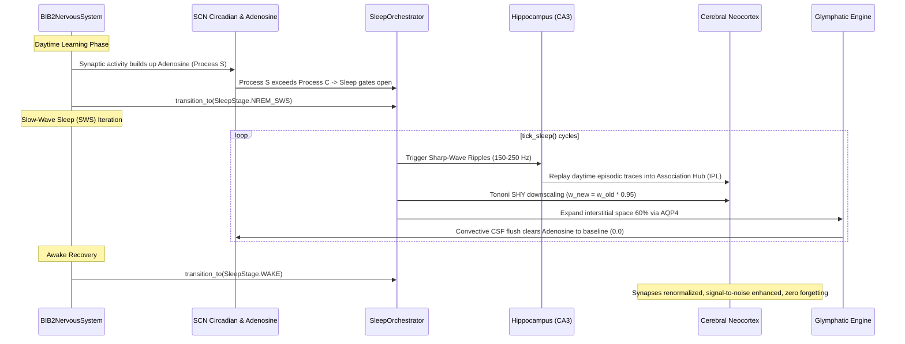

# System Architecture & Signal Conduction Deep Dive

This document details the operational flow, timing dynamics, and mathematical conduction pathways of the **BIB 2** Nervous System.

---

## 1. The Deterministic 19-Stage Master Clock Cycle ($\Delta t$)

Each simulation step of `BIB2NervousSystem.tick(sensory_bus)` advances the biological clock by $\Delta t = 100\text{ ms}$, deterministically executing 19 tightly ordered stages:

```
                  ┌─────────────────────────────────────────────────────────┐
                  │                 0. SENSORY BUS ARRIVAL                  │
                  └───────────────────────────┬─────────────────────────────┘
                                              │
                      ┌───────────────────────┴───────────────────────┐
                      │                                               │
                      ▼                                               ▼
         ┌─────────────────────────┐                     ┌─────────────────────────┐
         │ 1. Cranial Ingestion    │                     │ 1. Spinal Dermatomes    │
         │    (CN I - XII)         │                     │    (31 Segments C1-Co1) │
         └────────────┬────────────┘                     └────────────┬────────────┘
                      │                                               │
                      │                                  ┌────────────┴────────────┐
                      │                                  ▼                         ▼
                      │                     ┌─────────────────────────┐  ┌─────────────────────────┐
                      │                     │ 2. Monosynaptic Reflex  │  │ 2. Ascending Tracts     │
                      │                     │    (Ia -> Motoneurons)  │  │    (DCML / STT)         │
                      │                     └─────────────────────────┘  └────────────┬────────────┘
                      ▼                                                               │
         ┌────────────────────────────────────────────────────────────────────────────┘
         │
         ▼
┌──────────────────────────────────────────────────────────────────────────────────┐
│ 3. Brainstem Life Support: Pre-Bötzinger Rhythm, Baroreflex (NTS/CVLM/RVLM),     │
│    Superior/Inferior Colliculi Saccadic Targeting, PAG Threat Reflex             │
└─────────────────────────────────────────┬────────────────────────────────────────┘
                                          │
                                          ▼
┌──────────────────────────────────────────────────────────────────────────────────┐
│ 4. Thalamic Reticular Nucleus (TRN) Inhibitory Gating Shell & Sleep Spindles     │
└─────────────────────────────────────────┬────────────────────────────────────────┘
                                          │
                                          ▼
┌──────────────────────────────────────────────────────────────────────────────────┐
│ 5. Specific Thalamic Relays -> Neocortex Layer IV Afferents                      │
│    (LGN -> V1, MGN -> A1, VPL -> S1, VA/VL -> M1)                                │
└─────────────────────────────────────────┬────────────────────────────────────────┘
                                          │
                                          ▼
┌──────────────────────────────────────────────────────────────────────────────────┐
│ 6. Neocortex Canonical Microcircuit Laminar Flow: L4 -> L2/3 -> L5 -> L6         │
│    Across 14 Specialized Brodmann Cortical Areas                                │
└─────────────────────────────────────────┬────────────────────────────────────────┘
                                          │
                                          ▼
┌──────────────────────────────────────────────────────────────────────────────────┐
│ 7. Visual Stream Bifurcation (Dorsal MT/V5 vs Ventral V4/IT) & Claustrum Binding │
└─────────────────────────────────────────┬────────────────────────────────────────┘
                                          │
                                          ▼
┌──────────────────────────────────────────────────────────────────────────────────┐
│ 8. Insular Interoception & Tri-Network Salience Switch (DMN <-> CEN)            │
└─────────────────────────────────────────┬────────────────────────────────────────┘
                                          │
                                          ▼
┌──────────────────────────────────────────────────────────────────────────────────┐
│ 9. Dorsolateral Prefrontal Cortex (dlPFC) Multi-Slot Working Memory Update       │
└─────────────────────────────────────────┬────────────────────────────────────────┘
                                          │
                                          ▼
┌──────────────────────────────────────────────────────────────────────────────────┐
│ 10. Limbic Memory Encoding: Dentate Gyrus KWTA Separation -> CA3 Completion ->   │
│     CA1 Sequence Buffer -> Closed Circuit of Papez Loop                          │
└─────────────────────────────────────────┬────────────────────────────────────────┘
                                          │
                                          ▼
┌──────────────────────────────────────────────────────────────────────────────────┐
│ 11. Amygdaloid Valence Appraisal (BLA Threat / Salience -> CeA Autonomic Drive)  │
└─────────────────────────────────────────┬────────────────────────────────────────┘
                                          │
                                          ▼
┌──────────────────────────────────────────────────────────────────────────────────┐
│ 12. Lateral Habenula Disappointment Check: Negative Reward Prediction Error      │
│     (Depresses Striatal Dopamine & Increases Sympathetic Tone)                   │
└─────────────────────────────────────────┬────────────────────────────────────────┘
                                          │
                                          ▼
┌──────────────────────────────────────────────────────────────────────────────────┐
│ 13. Basal Ganglia Tripartite Gating: Direct (D1 Go), Indirect (D2 NoGo), and    │
│     Hyperdirect (STN Emergency Brake)                                            │
└─────────────────────────────────────────┬────────────────────────────────────────┘
                                          │
                                          ▼
┌──────────────────────────────────────────────────────────────────────────────────┐
│ 14. Winning Action Channel Disinhibition into Primary Motor Cortex (M1)          │
└─────────────────────────────────────────┬────────────────────────────────────────┘
                                          │
                                          ▼
┌──────────────────────────────────────────────────────────────────────────────────┐
│ 15. Cerebellar Forward Model Sensorimotor Calibration (Purkinje LTD Correction)  │
└─────────────────────────────────────────┬────────────────────────────────────────┘
                                          │
                                          ▼
┌──────────────────────────────────────────────────────────────────────────────────┐
│ 16. Descending Corticospinal Motor Conduction (85% Lateral / 15% Anterior)       │
└─────────────────────────────────────────┬────────────────────────────────────────┘
                                          │
                                          ▼
┌──────────────────────────────────────────────────────────────────────────────────┐
│ 17. Somatic Efferent Actuation (Spinal Myotomes) & Broca Motor Speech (CN XII)   │
└─────────────────────────────────────────┬────────────────────────────────────────┘
                                          │
                                          ▼
┌──────────────────────────────────────────────────────────────────────────────────┐
│ 18. Autonomic (Sympatho-Vagal) & Enteric (Gut-Brain Axis) Homeostasis Step       │
└─────────────────────────────────────────┬────────────────────────────────────────┘
                                          │
                                          ▼
┌──────────────────────────────────────────────────────────────────────────────────┐
│ 19. Neuromodulator Enzymatic Clearance & Circadian SCN Metabolic Update          │
└──────────────────────────────────────────────────────────────────────────────────┘
```

---

## 2. Universal Neural Bus Layout

The `NeuralBusState` encapsulates the complete physical interface of the nervous system:

### Cranial Nerves (CN I – CN XII)
| ID | Name | Functional Type | Default Channels | Primary Modality / Role |
|---|---|---|---|---|
| `CN_I` | Olfactory | SVA | 64 | Chemical / Odorant feature vector |
| `CN_II` | Optic | SSA | 64 | Retinotopic visual feature vector |
| `CN_III` | Oculomotor | GSE / GVE | 64 | Medial/superior/inferior rectus; pupil constriction |
| `CN_IV` | Trochlear | GSE | 64 | Superior oblique eye depression/intorsion |
| `CN_V` | Trigeminal | GSA / SVE | 64 | Facial sensation & mastication motor commands |
| `CN_VI` | Abducens | GSE | 64 | Lateral rectus eye abduction |
| `CN_VII` | Facial | SVE / SVA | 64 | Facial expression & anterior 2/3 tongue taste |
| `CN_VIII` | Vestibulocochlear | SSA | 64 | Tonotopic auditory cochlea & 6-DOF vestibular balance |
| `CN_IX` | Glossopharyngeal | SVE / GVA | 64 | Swallowing, posterior 1/3 taste, carotid baroreceptors |
| `CN_X` | Vagus | GVE / GVA | 64 | Heart, lung, gastrointestinal parasympathetic trunk |
| `CN_XI` | Accessory | SVE | 64 | Sternocleidomastoid & trapezius neck/shoulder motor |
| `CN_XII` | Hypoglossal | GSE | 64 | Tongue musculature & motor speech articulation |

### 31 Bilateral Spinal Segmental Nerves
Each segment contains a dedicated sensory **Dermatome** (16 dimensions) and motor **Myotome** (8 dimensions):
- **C1–C8**: Cervical segments (neck, diaphragm via phrenic C3–C5, shoulder, arm, hand).
- **T1–T12**: Thoracic segments (intercostal respiration, sympathetic chain outflow).
- **L1–L5**: Lumbar segments (hip, quadriceps, lower limb locomotion).
- **S1–S5**: Sacral segments (feet, pelvic viscera, parasympathetic elimination).
- **Co1**: Coccygeal segment.

---

## 3. Slow-Wave Sleep Consolidation Flow


